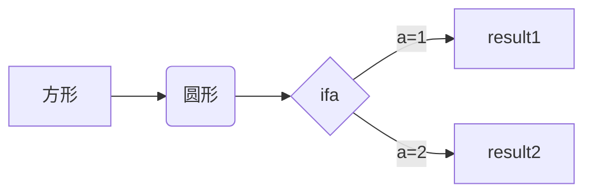

# 我的第一个markdown


**切换预览和源码模式**

```
command + /
```


**搜索**

```
command + F
```


**标题级别**

```
# 一级标题 command + 1
## 二级标题 command + 2
### 三级标题 command + 3
#### 四级标题 command + 4
##### 五级标题 command + 5
###### 六级标题 command + 6
```


**引用**

```
> 引用
command + option + Q
```

> 引用


**列表**

无序列表

```
* AAA
* BBB
* CCC

* 多行列表
TAB * 多行列表
TAB TAB * 多行列表

command + option + U
```

* AAA

* BBB

* CCC

   * ddd

      * eee

        

有序列表

```
1. AAA
2. BBB
3. CCC

1. 多行列表
TAB 1. 多行列表
TAB TAB 1. 多行列表

command + option + O
```

1. AAA
2. BBB
3. CCC
   1. ddd
   2. eee
      1. fff


任务列表

```
- [ ] 抽烟
- [x] 喝酒
```

- [ ] 喝酒

- [x] 喝酒


**代码**

```
单行代码：`String str="typora"`
代码块：```回车
代码块：~~~回车
command + option + C
```

`String str="typora"`

```
代码块：```回车
```

~~~
代码块：~~~回车
~~~


**数学表达式**

```
$$回车
command + option + B
```

$$
P_{u,i}=\frac{\sum_{j}^n(sum{_{u,j}})*R_{j,i}}{\sum_{j}^nsim_{u,j}}
$$


**表格**

```
|表头1|表头2|回车
英文输入"|"
```

| 表头1 | 表头2 |
| ----- | ----- |
|       |       |


**图**

流程图

```
​```mermaid回车
graph LR 横向流程图（LR：从左到右，RL：从右到左）
graph TD 竖向流程图（TD：从上到下，没有从下到上）

graph LR
A[方形] --> (圆形)
B --> C{ifa}
C --> |a=1| D[result1]
C --> |a=2| E[result2]
```





UML时序图

```
​```memaid sequenceDiagram + 回车
```

```memaid
？？？
```


**超链接**

```
[链接文字](链接地址) command + K
<链接地址>


command + 点击跳转链接
```

[百度](https://www.baidu.com)

<https://github.com>


**分割线**

```
*** + 回车
--- + 回车
```

***

---


**内联样式**

字体

```
1. **字体加粗** command + B
2. __字体加粗__
3. *字体倾斜* command + I
4. _字体倾斜_
5. <u>下划线</u> command + U
6. ~~删除线~~
```

1. **字体加粗**

2. __字体加粗__
3. *字体倾斜*
4. _字体倾斜_
5. <u>下划线</u>
6. ~~删除线~~


**注脚**

```
Baidu[^1]
[^1]:https://www.baidu.com
```

Baidu[^1]


**特殊字符**

```
&copy;     版权
&times;    乘号
&divide;   除号
&plusmn;   加减号
&lt;       小于号
&gt;       大于号
&ne;       不等号
&le;       小于等于
&ge;       大于等于
&nbsp;     空格
&amp;      与
&quot;     双引号
&apos;     单引号
```

&copy;版权

&times;乘号

&divide;除号

&plusmn;加减号

&lt;小于号

&gt;大于号

&ne;不等号

&le;小于等于号

&ge;大于等于号

&nbsp;空格

&amp;与

&quot;双引号

&apos;单引号


***

[^1]:https://www.baidu.com


**快捷键总结**

1. 切换浏览和源码模式 command + /
2. 搜索 command + F
3. 标题级别 command + 1（1~6）
4. 字体加粗 command + B
5. 字体倾斜 command + I
6. 下划线 command + U
7. 无序列表 command + option + U
8. 有序列表 command + option + O
9. 代码块 command + option + C
10. 引用 command + option + Q
11. 数学表达式 command + option + B

